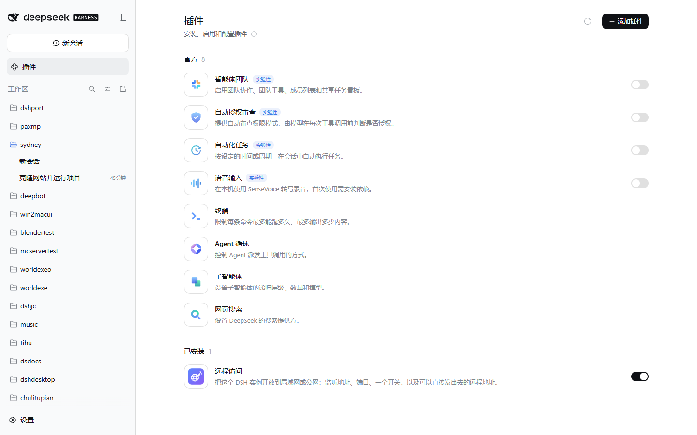
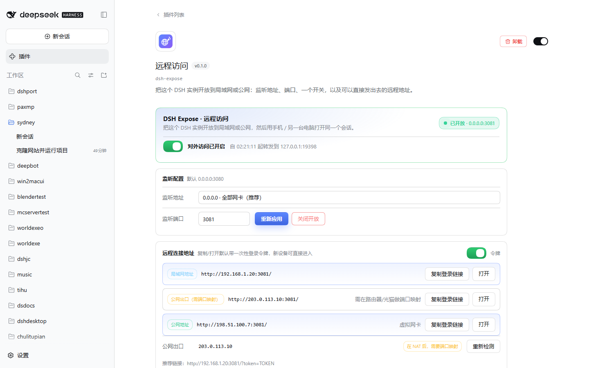
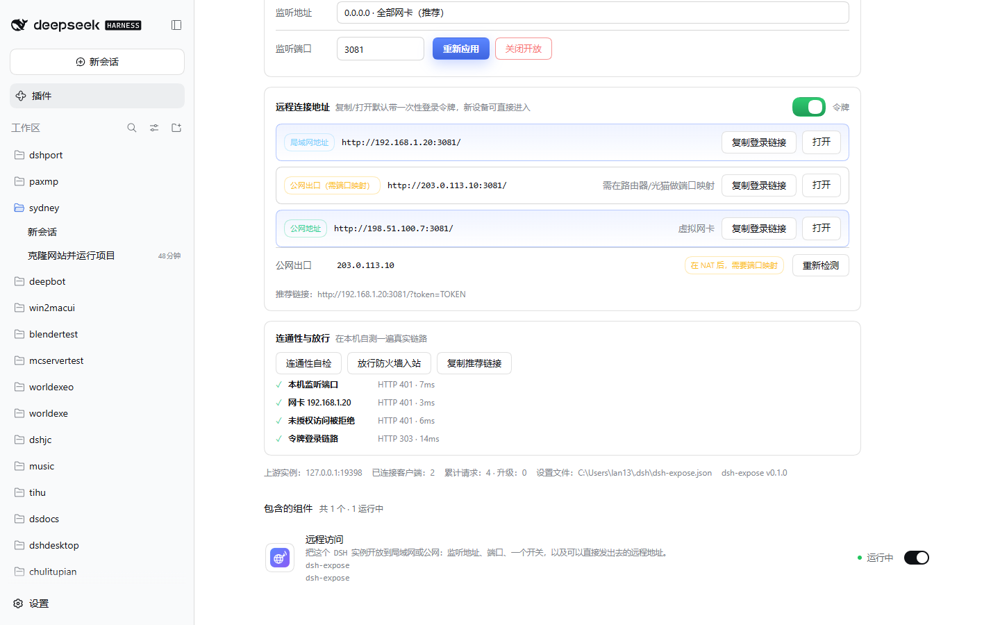
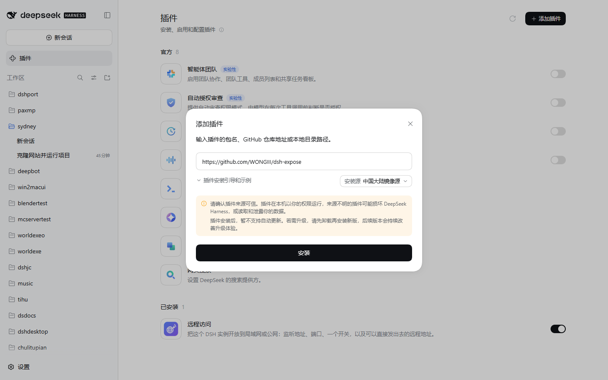

# dsh-expose · 远程访问

**把一个正在运行的 DSH 实例，一键开放到局域网或公网。**

中文 | [English](README.en.md)

选好监听地址（默认 `0.0.0.0`）和端口（默认 `3080`），按一下开关，插件就把这台机器上正在跑的那个 DSH 实例原样发布出去：手机、平板、另一台电脑打开 `http://192.168.1.20:3080/` 就能接着用同一个会话。开放后页面直接列出可复制的连接地址——局域网地址、直连公网地址，或者在 NAT 后面时提示你做端口映射的公网出口地址。

安装后它出现在 **插件页**（已安装列表，可启用/停用/卸载），配置面板就在它自己的详情页里；**设置 → 内置插件 → 远程访问** 是同一个面板的另一个入口。







> 截图里的 `192.168.1.20` / `203.0.113.10` / `198.51.100.7` 是文档占位地址，`token=TOKEN` 也是占位符。

```
┌──────────────────────────────────────────────────────────────┐
│ DSH Expose · 远程访问                          ● 已开放      │
│ 把这个 DSH 实例开放到局域网或公网…           0.0.0.0:3080    │
│                                                              │
│  [ ●——]  对外访问已开启   自 21:02:11 起转发到 127.0.0.1:19387│
│                                                              │
│  监听地址  [ 0.0.0.0 · 全部网卡（推荐）        ▾ ]           │
│  监听端口  [ 3080 ]        [ 保存并开放 ]  [ 关闭开放 ]       │
│                                                              │
│  远程连接地址                      复制/打开默认带登录令牌 [●] │
│  ┌ 局域网地址  http://192.168.1.20:3080/    [复制] [打开] ┐  │
│  ┌ 公网出口    http://203.0.113.10:3080/    [复制] [打开] ┐  │
│                                                              │
│  [连通性自检] [放行防火墙入站] [复制推荐链接]                 │
│  ✓ 本机监听端口 401 · 7ms   ✓ 网卡 192.168.1.20 401 · 3ms    │
│  ✓ 未授权访问被拒绝 401     ✓ 令牌登录链路 303 · 14ms        │
└──────────────────────────────────────────────────────────────┘
```

## 为什么需要它

DSH 的 Web 载体故意只监听 `127.0.0.1`：`--host 0.0.0.0` 是**明确的用法错误**，因为它会把远程代码执行能力直接暴露到网络上。`dsh-expose` 不绕过这个决定，而是在它外面加一层你自己控制的转发监听器，并保持原有的每一道防线都在工作：

| 官方防线 | 本插件的做法 |
| --- | --- |
| 只绑定回环 | 转发监听器由你显式开关、显式选地址和端口，默认关闭 |
| `/api` 的 Host/Origin 护栏 | 入站 `Host`、`Origin`、`Referer` 重写为上游回环权威，护栏看到的永远是自己人 |
| 绑定权威的浏览器 Cookie | 不触碰 Cookie 本身：令牌登录仍在目标浏览器上换取该权威的会话 |
| 无令牌 = 401 | 原样透传，匿名访问依旧被拒（自检里能看到 401） |
| 远程执行能力 | 远端浏览器拿到的仍然只是一个普通的 DSH 会话，权限模型不变 |

也就是说：**端口是你开的，登录还是 DSH 的登录。**

## 安装

**在 GUI 里装**：打开 **插件** 页 → **添加插件** → 在输入框里粘贴下面任意一行，回车即可。

```
https://github.com/WONGIII/dsh-expose
github:WONGIII/dsh-expose
```



装好并启用后，它会出现在「已安装」里，标题、简介和图标都来自包内的显示元数据（见上方第一张图）。

**在命令行里装**：

```bash
# Web 版
dsh plugin --profile web add github:WONGIII/dsh-expose

# Desktop 版（Electron）：profile 名是 desktop
dsh plugin --profile desktop add github:WONGIII/dsh-expose

# 锁版本（推荐）：tag 或 commit
dsh plugin --profile web add github:WONGIII/dsh-expose#v0.1.0

# 或者本地 checkout 联调
dsh plugin --profile web add link:/path/to/dsh-expose
```

装完重启 DSH：

1. 打开 **插件** 页，在「已安装」里能看到 **远程访问**，开关处于运行中；
2. 点进它的卡片，配置面板就在这一页（描述下方、组件行上方）；**设置 → 内置插件 → 远程访问** 是同一个面板。

**不需要批准任何构建脚本**：`lib/` 是随仓库一起提交的产物，包内没有任何 `prepare`/`postinstall`，所以 pnpm 不会弹「Allow these scripts」；包也没有 `dependencies`，安装不下载任何第三方包。升级方式同样是重新安装：

```bash
dsh plugin --profile web remove dsh-expose
dsh plugin --profile web add github:WONGIII/dsh-expose
```

> 端口写在 `$DSH_HOME/dsh-expose.json`，所以开关状态和端口在重启后依然生效；若上次是开启状态，重启后会自动重新开放。

## 符合 DSH 插件规范

| 规范 | 本仓库的做法 |
| --- | --- |
| bundle 清单 | `package.json` 声明 `dsh.bundle.patch` → `cordis.patch.yml` 用一条 `insert` 行挂载 `dsh-expose` |
| 浏览器半 | `dsh.client.platform: "web"` + 导出 `./client`，产物是 `window.__ModuleLoader__.load(...)` 注册形式 |
| 配置页 | 注册到官方约定的 `plugins.bundle.config`（keyed by 包名 `dsh-expose`），渲染在插件自己的详情页；另在 `settings.plugins.tab` 提供同样的面板 |
| 显示元数据 | `locale/en.json`、`locale/zh.json` 提供 `meta.title` / `meta.description`（中英文名与一句话简介），顶层 `"icon": "./assets/icon.svg"` 提供卡片图标 |
| 导出与发布 | `exports` 暴露 `.`、`./client`、`./cordis.patch.yml`、`./locale/*.json`、`./package.json`；`files` 覆盖上述全部产物 |
| 产物随源码提交 | `lib/` 已提交，git 安装不需要构建脚本批准（官方 *Package and install a plugin* 里那条 pnpm ≥10 的坑，这里直接绕开） |
| 无运行时依赖 | 宿主半只用 Node 内置模块，浏览器半只用页面自带的 React；因此不声明 `peerDependencies`，安装时不会触发 peer 版本判定 |

## 使用

1. **监听地址**：默认 `0.0.0.0`（全部网卡）。也可以只绑某一张网卡，例如只允许 WLAN 访问；虚拟网卡（Radmin/Tailscale/OpenVPN…）会被标注，且不会被选作推荐地址。
2. **监听端口**：默认 `3080`，可改成任意 1–65535。
3. **开关**：`保存并开放` / `关闭开放`。关闭后端口立刻释放，回到官方默认的仅本机可访问。
4. **远程连接地址**：
   - 「令牌」开关默认打开：复制/打开的是带一次性登录令牌的链接，新设备点开即登录（令牌随 DSH 进程变化，每次都会重新取）。
   - 关掉它则是纯地址，适合已经在浏览器里登录过的设备。
   - 地址后面的标记会告诉你它是局域网、公网直连，还是 NAT 后需要端口映射。
5. **连通性自检**：在本机依次跑通「监听端口 → 真实网卡地址 → 未授权被拒 → 令牌登录」四段链路，全部变绿才算真的通了。
6. **放行防火墙入站**：Windows 上执行 `netsh advfirewall` 添加对应端口的入站规则（需要管理员权限，权限不足时会显示要手动执行的命令）。

## 公网访问

插件通过外部回显服务读取本机的公网出口 IP，并区分两种情况：

- **直连公网**：公网 IP 就在本机某张物理网卡上（无 NAT）→ 显示「直连公网，可直接访问」；
- **NAT 之后**：公网 IP 不等于任何本机物理地址（家用宽带几乎都是这种）→ 显示公网地址，并标注「需在路由器/光猫做端口映射」。

需要从公网访问时，除了映射端口，也请务必：使用强口令/受控网络、只开放必要端口、用完随手关掉开关。这个插件给的是**可达性**，不是**鉴权**——鉴权始终是 DSH 自己的浏览器会话。

## 控制 API

浏览器半用的是这几个同源、且经过 DSH `/api` 护栏与 Cookie 鉴权的接口（`ctx.connection.fetch` 注册），远程匿名访问同样拿不到：

| 方法 | 路径 | 说明 |
| --- | --- | --- |
| GET | `/api/dsh-expose/state` | 当前设置、监听状态、地址列表、公网出口、计数器、自检结果 |
| POST | `/api/dsh-expose/config` | `{ enabled?, host?, port? }`，保存并立即生效 |
| POST | `/api/dsh-expose/refresh` | 重新探测公网出口 IP |
| POST | `/api/dsh-expose/probe` | 跑一次连通性自检 |
| POST | `/api/dsh-expose/firewall` | `{ action: "add" \| "remove" \| "status" }` |

## 开发

```bash
npm run build            # 由 src/client.js 生成 lib/client.js（模块加载器注册形式）
npm run check            # 校验产物是否最新
npm run verify:package   # 校验 bundle/浏览器半/locale/图标/files/清单是否符合 DSH 插件规范（46 项）
npm test                 # 31 个用例：转发/改写/隧道、地址分类、持久化、浏览器半、宿主半集成
npm run verify           # check + verify:package + test
```

现场验证脚本（对着一个真实在跑的 dsh 实例跑一遍完整链路）：

```powershell
./scripts/verify-live.ps1 -Base http://127.0.0.1:19399 -Token <启动时打印的 token> -LanIp 192.168.1.20
```

## 结构

```
lib/index.js     宿主半：设置、生命周期、控制 API
lib/proxy.js     转发监听器：HTTP + Upgrade，Host/Origin/Location 改写与计数
lib/network.js   地址发现与分类、公网出口探测
lib/state.js     $DSH_HOME/dsh-expose.json 的原子读写
lib/client.js    浏览器半（由 src/client.js 构建）：插件详情页配置 + 设置页标签
src/client.js    浏览器半源码（React，无外部依赖）
scripts/         构建、规范自检与现场验证
test/            node:test 用例
```

## License

MIT
